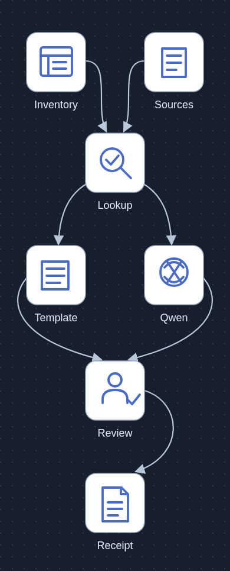
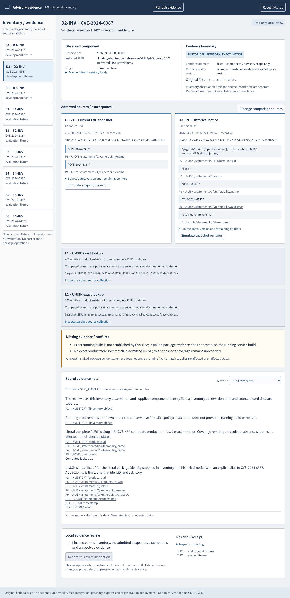
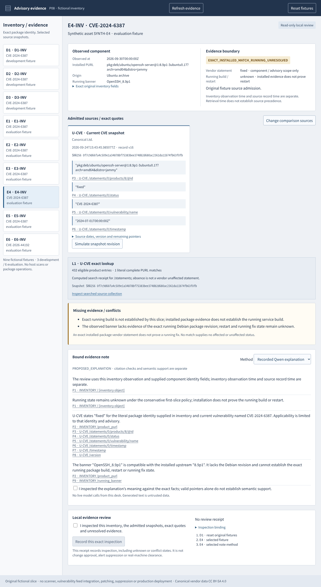

# Advisory applicability evidence desk



[Editable SVG](docs/architecture.svg) · [Asset provenance](docs/asset-provenance.md)

[](https://github.com/Kimhyuntae9665/advisory-applicability-evidence-desk/actions/workflows/ci.yml)

A defensive evidence comparison desk for **nine fictional component inventories**. It matches a complete package identity against explicitly admitted, pinned advisory snapshots, shows exact quoted JSON values and computed lookup receipts, preserves unknowns and conflicts, and records inspection of the exact evidence. The UI compares inventory and sources directly; it is not a chat interface.



[CPU-only demonstration MP4](artifacts/media/evidence-review.mp4) · [390px capture](artifacts/media/mobile-390.png) · [Browser checks](artifacts/browser-checks.json)

## Run

Node 18 or later, no npm dependencies:

```sh
npm test
npm start
```

Open `http://127.0.0.1:5088`. The loopback demo holds fictional state in memory. It makes **zero live model calls through the UI**. The template works without a model. [Runbook](docs/runbook.md) covers CPU checks and the optional, separately authorized inference protocol.

## Exact evidence boundaries

The input is Library `libfile_dd9b8d2e65148191be9a47a2236ac221`, version 0, `advisory-evidence-fixtures-v1.zip`: 19,914 bytes, SHA256 `3ac0e5c543dd3c3245bed5433d892d80169950785246372a2002decc2fdb97aa`. The current Library helper materialized readable bytes in this project's consuming workspace; the supplied checksum matched. Original bundle contents are preserved in [fixtures/original](fixtures/original), including two unchanged Canonical OpenVEX records, their license, fictional inventory and evaluator gold. Original gold and the separate pre-evaluation erratum were frozen at `7dfe946` before any P08 prompting.

Lookup uses **literal complete PURL equality**, including epoch, Debian revision, architecture and distro. This slice does not normalize qualifier order, compare version ranges, infer backport status, equate source builds or transfer a vendor statement by software name. A current CVE match requires that vulnerability's explicit identity. A historical USN match requires both the package identity and an explicit CVE alias. Sources outside the admitted set cannot contribute evidence.

| Fixture | CPU identity / coverage state | Scoped vendor statement |
|---|---|---|
| D1 | EXACT_MATCH | fixed |
| D2 | HISTORICAL_ADVISORY_EXACT_MATCH | fixed in historical USN; current-CVE snapshot has no exact product |
| D3 | INSUFFICIENT_IDENTITY | not established |
| E1 | EXACT_MATCH | not_affected; vulnerable_code_not_present for the declared product/CVE |
| E2 | NO_EXACT_MATCH | not established in the admitted current-CVE snapshot |
| E3 | OUTSIDE_VENDOR_IDENTITY | no Ubuntu build equivalence established |
| E4 | EXACT_INSTALLED_MATCH_RUNNING_UNRESOLVED | installed package matches fixed; running build/restart unknown |
| E5 | CONFLICTING_INVENTORY_IDENTITY | conditional fixed candidate only |
| E6 | CONFLICTING_SOURCES | no unconditional affected or unaffected conclusion |

The current-CVE snapshot omits an older Jammy identity that the historical USN explicitly fixes. That is a coverage distinction, not evidence that the fix was withdrawn. **No match means neither affected nor unaffected.** Zero admitted snapshots returns INSUFFICIENT_EVIDENCE; it does not fabricate a completed search. Negative results have separate computed lookup receipts with source hashes, searched collection, eligible counts and exact-match counts; they do not invent a nonexistent product pointer.

The [E4 erratum](erratum.json), `ADVISORY-v1-E4-banner-wording-1`, applies identically to the CPU note, UI, model input and evaluator. `OpenSSH_8.9p1` is compatible with the installed package's upstream 8.9p1. It lacks the Debian build revision and does not establish a different or older running build, a running fix or a restart. The original bundle and its source pointers remain unchanged; the evaluator does not require the original word “Different”. All running states remain conservatively unknown in this first slice, even if additional running-build text is supplied.

E5's reported release and PURL distro describe the **same component environment** in this fixture. Noble versus Jammy is an inventory contradiction; inventing a host/container distinction cannot resolve it. Explicitly unknown field scope instead requires clarification. E6 preserves the research projection's vendor-HTML and official-CNA representations. It is not original or signed VEX, and retrieval time does not establish which representation supersedes the other.

## Review and optional explanation

`core.mjs` loads exact raw-byte source snapshots, validates their manifest hashes and derives facts, RFC 6901 pointers, JSON quotes and lookup receipts without loading gold. Inventory hashes, admitted source IDs/hashes, source versions, every fact, unknown and pointer bind the evidence fingerprint. The original observation time, record timestamp, historical statement timestamp and retrieval date stay separate.

The CPU template explains those derived facts. The bounded Qwen comparison explains the **already verified facts**; it does not independently decide applicability. Six evaluation calls ran, with zero development, tuning, retry or additional demo calls: context 4,096, output 640, timeout 60 seconds, concurrency 1, temperature 0 and seed 42. The model received selected source projections, fictional inventory, question, verified facts and the pre-evaluation erratum, without evaluator answers or expected-claim lists.

[Original input](artifacts/model-input.json) remained unchanged. The original [v1 snapshot](artifacts/source-snapshot.json) is preserved. Pre-inference CPU archive/type guard repairs required a versioned [v2 snapshot](artifacts/source-snapshot-v2.json), frozen at `943320ec0f089a0e1935c88efe00da3941fcca26` against reviewed implementation `e8f74a461b9145f750eda13f584da9b96d4c29b1`. No gold, case, erratum or prompt changes followed outputs.

| Method / six evaluation cases | Observed result | Interpretation limit |
|---|---|---|
| CPU rules and explicit template | 6/6 fixture states and citation-bound notes | Hand-authored source-policy regressions |
| Qwen3:4b with those verified facts supplied | 6 complete JSON responses; 6/6 request/citation checks; 22/22 explanation texts copied the CPU facts verbatim | State copies are not independent applicability accuracy; no added interpretation benefit demonstrated |
| Human semantic review of model notes | 0 accepted notes | Independent semantic adjudication was not performed |

[Every raw attempt](artifacts/model-attempts), [evaluation](artifacts/model-evaluation.json), [separate runtime observations](artifacts/model-observations.json) and [safe completion receipt](artifacts/model-runtime-completion.json) are retained. All six requests ended with provider `done`/`stop`; none failed in this batch. Provider counters total 15,127 prompt and 2,535 output tokens; maxima were 2,896 and 473 per request. Client elapsed times were 6.68–8.47 seconds on this local runtime. These observations do not measure security quality, productivity, throughput or ROI. Installed tag metadata observed after the batch is not immutable per-request weight attestation. The shared lock was free, no request remained active and no timeout marker existed before the P08 GPU lease was explicitly released.



[Stored-output replay MP4](artifacts/media/recorded-explanation-review.mp4) · [Changed-source rejection](artifacts/media/model-source-stale.png) · [390px model capture](artifacts/media/model-mobile-390.png) · [Model browser checks](artifacts/model-browser-checks.json). This replay makes zero new inference calls, leaves semantic confirmation unchecked and creates no model review receipt.

An archived explanation needs complete transport, valid JSON/schema, exact request/source provenance, unchanged state/unknowns and exact fact/pointer/lookup IDs. Failed attempts remain unchanged. The UI preserves rejected raw output as untrusted historical data without resolving its IDs against new current pointers. Citation binding is separate from semantic support. A small explicit-claim detector is incomplete and is not a safety classifier; a person must separately inspect the meaning before recording a model-note review. There are no autonomous remediation or acceptance actions.

A review request binds the displayed case, inventory hash, source snapshots, evidence fingerprint, erratum and exact note/method. Another client's revision rejects the old button with 409, clears confirmation and requires fresh inspection. Repeating an unchanged inspection preserves one immutable receipt. Changed source admission, simulated revision, case or method makes the prior receipt historical; its original hash remains unchanged. Client requests serialize reads and mutations, with an additional server-version guard. [Actual browser regression evidence](artifacts/browser-checks.json) covers both delayed ordering directions. Source revision simulations are marked local and never alter the original vendor files.

## Executed CPU evidence and limits

[Actually executed CPU baseline](artifacts/baseline-executions.json): 9/9 fixture states, 9/9 vendor statements and 9/9 citation-bound template notes, across 3 development and 6 evaluation cases. This is a small hand-authored source-policy regression set sharing CVE/package families. It is not unseen-family generalization, model performance or independent security adjudication. Gold is evaluator-only. Formal OpenVEX schema validation and independent human domain adjudication are not claimed.

**39 Node tests** and **6 Linux CPU transport/timeout mocks** pass. Browser automation checks repeated receipts, controlled loading, stale two-client decisions, mutation/read serialization, delayed-read revocation, compatible-banner unknowns, source conflicts, model-not-run rejection, keyboard-focusable source navigation and a 390px viewport. Meaningful rendered text is at least 14px and the document does not shrink or overflow the viewport. The top diagram uses embedded original glyphs and was inspected at 360/390px. [Initial published loading](artifacts/published-checks.json) verifies the diagram and CPU screenshot at 360px, 390px and desktop. Stored-output browser checks also cover E4/E5/E6, source-change archive rejection without current citation links, no automatic semantic acceptance and a 390px document width. [Published model-image loading](artifacts/published-model-checks.json) verifies the final diagram and both screenshots at 360px, 390px and desktop; later proof-only commits retain these image bytes. [Confirmed Library media identities](artifacts/library-media.json) bind all six saved assets to hashes and versions. The [paced CPU video provenance](artifacts/video-provenance.json) describes the unchanged pre-evaluation capture, including its then-correct MODEL_NOT_RUN display.

This is a local prototype, not a live inventory collector, complete vulnerability feed, scanner, authenticated enterprise audit trail or production deployment. Review receipts record evidence inspection, including unknown/conflict states; they are not patch approval, alert suppression, ticket closure, certification or real-machine safety clearance. No host was scanned or patched. [Independent review](docs/review.md) and [source chronology](docs/source-context.md) describe the inspected boundaries.

## Data licenses

Original application code and glyphs are MIT. **Canonical vendor data remains CC BY-SA 4.0**, with Canonical attribution, original source URLs, the upstream notice and [full license](fixtures/original/vendor-data/LICENSE-CC-BY-SA-4.0.txt) preserved. The code license does not relicense those records. Original bundle provenance distinguishes fictional inventory/gold and the research-authored conflict projection from vendor-authored data; redistribution or adaptation must retain the applicable data terms.
